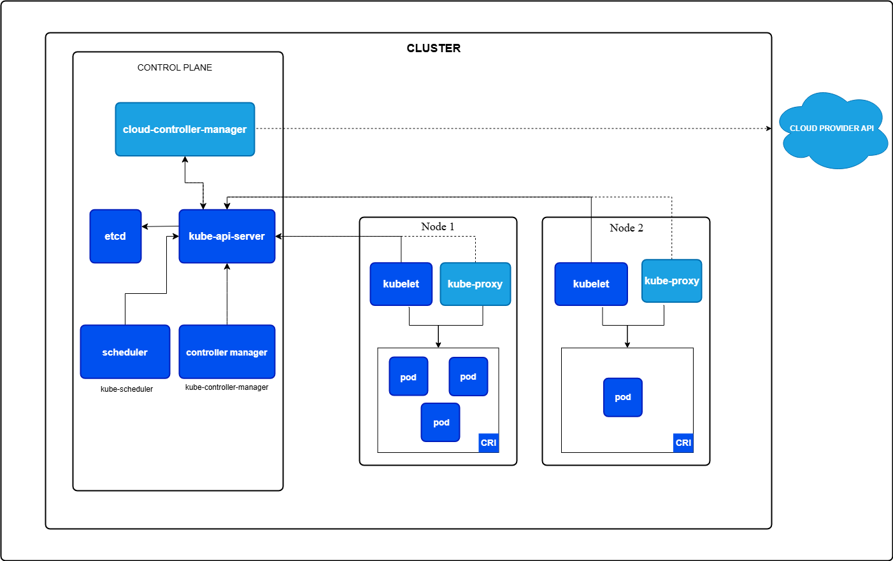

# Cluster Architecture

A Kubernetes cluster consists of a control plane plus a set of worker machines, called nodes, that run containerized applications. Every cluster needs at least one worker node in order to run Pods

